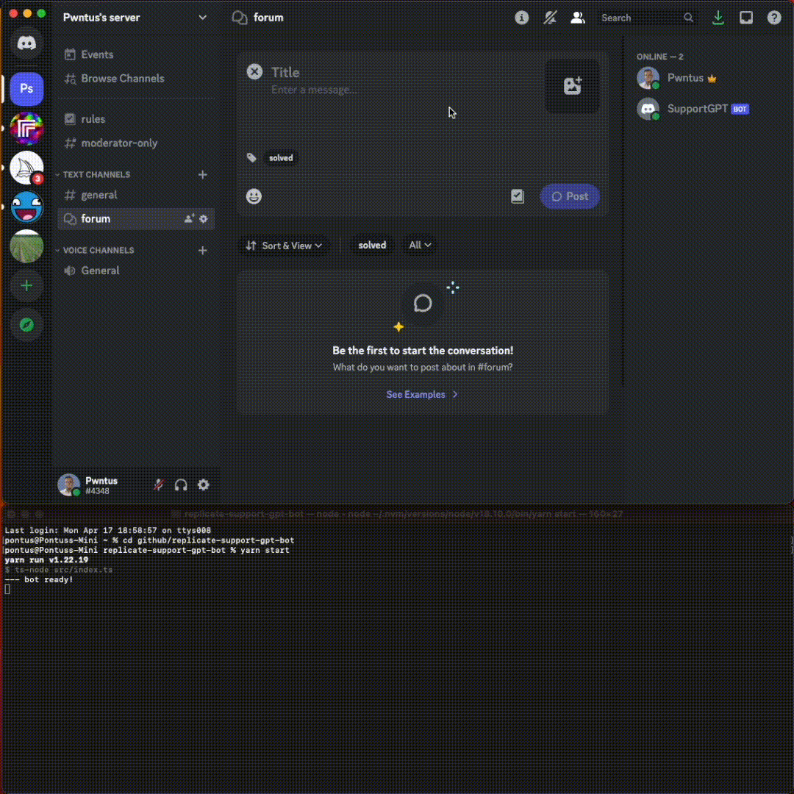

# Replicare bot

A Discord bot that answers questions about [Replicate](https://replicate.com). Use this to make ChatGPT answer questions based on **your** documentation.



## 1. How it works

The goal is to make ChatGPT answer questions within a limited context, where the context is a relevant section of a larger documentation. To do this we use [embeddings](https://platform.openai.com/docs/guides/embeddings). In short, embeddings are tokens converted into vectors that can be used to calculate how closely related two strings are. If we split the documentation into chunks and encode them as embeddings in a vector database, we can query relevant documentation chunks later if we use the same encoding on questions. The relevant documentation chunks will then be used as context for a ChatGPT session.

This app is powered by:

⚡️ [Supabase](https://supabase.com/), for vector based database.

## 2. Setup vector database (Supabase)

se supports vectors in their PostgreSQL database. Create an account and execute the following queries:

Enable the vector extension:

```sql
create extension vector;
```

Create a table for the documentation chunks:

```sql
create table documents (
  id bigserial primary key,
  content text,
  url text,
  embedding vector (1536)
);
```

Create a PostgreSQL function that uses the `<=>` cosine distance operator to get similar documentation chunks.

```sql
create or replace function match_documents (
  query_embedding vector(1536),
  similarity_threshold float,
  match_count int
)
returns table (
  id bigint,
  content text,
  url text,
  similarity float
)
language plpgsql
as $$
begin
  return query
  select
    documents.id,
    documents.content,
    documents.url,
    1 - (documents.embedding <=> query_embedding) as similarity
  from documents
  where 1 - (documents.embedding <=> query_embedding) > similarity_threshold
  order by similarity desc
  limit match_count;
end;
$$;
```

### 2.1 Populate vector database with embeddings

Modify the [scripts/create-embeddings.js](./scripts/create-embeddings.js) script to include URLs of the documentation to create embeddings of:

```js
// Add documentation URLs to be fetched here
const urls = [
  "https://replicate.com/home",
  "https://replicate.com/docs",
  "https://replicate.com/docs/get-started/python",
  // ...
];
```

And run it:

```bash
node scripts/create-embeddings.js
```
